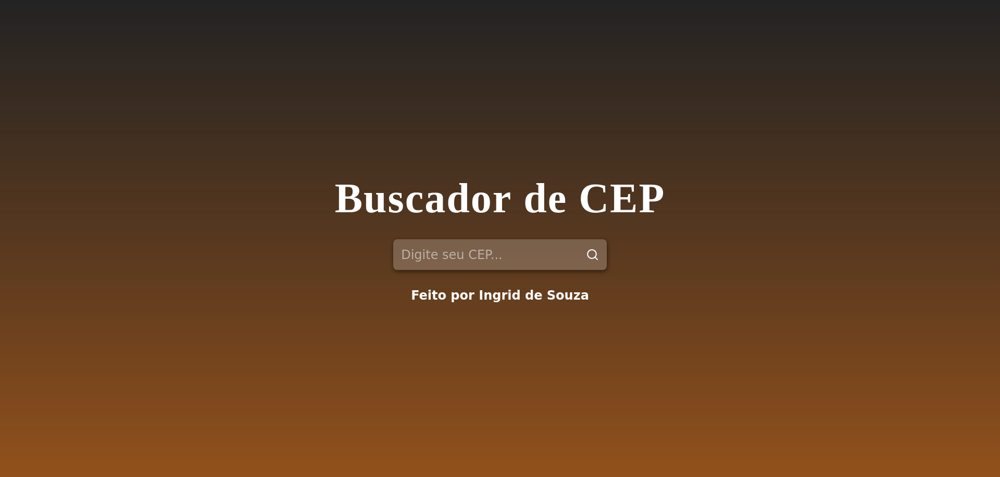

# Buscador de CEP

Site que utiliza uma API e fornece informações sobre alguns locais a partir do CEP.

This project was bootstrapped with [Create React App](https://github.com/facebook/create-react-app).

## Table of contents

- [Screenshot](#screenshot)
- [Author](#author)

## Screenshot

## Linguagem

<strong>Desenvolvido com:</strong>

<ul>
        <li>React</li>
        <li>Componentes React, Classes e useState</li>
        <li>CSS</li>
</ul>

## Author

- Website - [Ingrid Souza](https://ingriddev.netlify.app/)
- GitHub - [@IngridsSilveira](https://github.com/IngridsSilveira)

